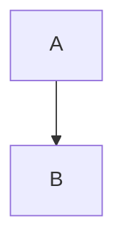

# Fmt this Shit - AI/Markdown to Word Converter

Convert Markdown/AI output to perfectly formatted Word documents with one click

[](https://opensource.org/licenses/MIT)

## Features

- 📝 **Real-time Preview** - Automatic conversion and preview while typing
- 🧮 **Math Formulas** - Perfect LaTeX math formula support
- 📊 **Mermaid Diagrams** - Automatic rendering of flowcharts as images
- 📋 **Table Conversion** - Markdown tables to Word tables
- 💻 **Code Blocks** - Preserve code formatting and syntax highlighting
- 📄 **Batch Export** - One-click Word document export
- 🚀 **One-Click Launch** - Ready-to-use portable package

---

## Get Started

### 📦 Portable Package (Recommended)

Don't want to configure the environment? Just download the portable package and double-click `start.bat` to run.

➡️ [Download Latest Portable Package from Releases](https://github.com/darknessbright/fmt-this-shit/releases)

### 💻 Source Code

For developers or users who need custom configuration:

```bash
git clone https://github.com/darknessbright/fmt-this-shit.git
cd fmt-this-shit
# See installation instructions below
```

---

## System Requirements

### Portable Package
- Windows 10 or higher
- No need to install Python/Node.js

### Source Code
- Python 3.8 or higher
- Node.js 16+ and npm
- Windows 10+ / macOS / Linux

---

## Quick Start

### Method 1: Portable Package (Recommended)

1. Download the portable package from [Releases](https://github.com/darknessbright/fmt-this-shit/releases)
2. Extract to any directory
3. Double-click `start.bat`
4. Browser automatically opens http://localhost:5678

### Method 2: Source Code

#### Windows Users

```bash
# 1. Clone repository
git clone https://github.com/darknessbright/fmt-this-shit.git
cd fmt-this-shit

# 2. One-click launch (auto-configure environment)
start.bat
```

#### macOS/Linux Users

```bash
# 1. Clone repository
git clone https://github.com/darknessbright/fmt-this-shit.git
cd fmt-this-shit

# 2. Create virtual environment
python3 -m venv .venv
source .venv/bin/activate

# 3. Install dependencies
pip install -r requirements.txt
npm install @mermaid-js/mermaid-cli

# 4. Download Pandoc
# Visit https://pandoc.org/installing.html
# Extract to the pandoc/ folder in project root

# 5. Start service
python backend/app.py
```

After successful startup, visit http://localhost:5678

---

## Usage

### Supported Markdown Syntax

#### Headings
```markdown
# Heading 1
## Heading 2
### Heading 3
```

#### Math Formulas
- Inline: `$E=mc^2$`
- Block: `$$\int_0^1 x dx$$`

#### Mermaid Diagrams
````markdown

````

#### Tables
```markdown
| Col1 | Col2 |
|------|------|
| Content1 | Content2 |
```

#### Code Blocks
````markdown
```python
def hello():
    print("Hello, World!")
```
````

### Basic Operations

1. **Input** - Type Markdown or AI-generated text in the left editor
2. **Preview** - Right side automatically shows conversion result
3. **Export** - Click "Export Word" button to download document

---

## Tech Stack

- **Backend**: Flask 3.0, Pandoc, python-docx
- **Frontend**: HTML5, CSS3, JavaScript (ES6+)
- **Editor**: CodeMirror 5.x
- **Diagram Rendering**: mermaid-cli
- **Math Formulas**: MathJax 3.x (browser-side rendering)

---

## Project Structure

```
fmt-this-shit/
├── backend/           # Flask backend
│   ├── app.py        # Application entry
│   ├── convert.py    # Conversion logic
│   └── temp/         # Temporary files (auto-cleaned)
├── frontend/          # Frontend files
│   ├── index.html    # Main page
│   ├── css/          # Stylesheets
│   ├── js/           # JavaScript
│   └── libs/         # Third-party libraries
│       └── codemirror/  # CodeMirror (download separately)
├── docs/             # Documentation
├── start.bat         # Windows one-click launcher
├── requirements.txt  # Python dependencies
└── package.json      # npm dependencies
```

---

## FAQ

### Q: What's the difference between portable package and source code?
**A:** The portable package comes with built-in Python virtual environment and npm dependencies. Just download, double-click `start.bat` and run. Perfect for users who don't want to configure the environment. Source code version requires installing Python and Node.js, but allows custom configuration.

### Q: Mermaid diagrams not displaying?
**A:**
- **Portable Package**: mermaid-cli is built-in, ready to use
- **Source Code**: Run `npm install @mermaid-js/mermaid-cli` to install

### Q: Math formulas display incorrectly?
**A:** Make sure Pandoc version is correct (2.19+). Portable package comes with the correct version built-in.

### Q: Exported Word file won't open?
**A:** Check if `backend/temp/` directory has write permissions.

### Q: CodeMirror editor fails to load?
**A:** Need to download CodeMirror 5.x separately:
1. Visit https://codemirror.net/
2. Download and extract to `frontend/libs/codemirror/`

---

## License

This project is licensed under the [MIT License](LICENSE).

---

## Contributing

Issues and Pull Requests are welcome!

- 🐛 [Report Bug](https://github.com/darknessbright/fmt-this-shit/issues/new?template=bug_report.md)
- 💡 [Feature Request](https://github.com/darknessbright/fmt-this-shit/issues/new?template=feature_request.md)
- 🔧 [Submit Code](https://github.com/darknessbright/fmt-this-shit/pulls)

---

## Star History

If this project helps you, please give it a ⭐️ Star!

---

**[中文文档 / Chinese Documentation](README.zh-CN.md)**
