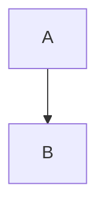

# AI2Word

AI/Markdown 转 Word 转换工具 - 支持实时预览和格式保留

## 功能特性

- 📝 **实时预览** - 输入时自动转换并预览
- 🧮 **数学公式** - 完美支持 LaTeX 数学公式
- 📊 **Mermaid 图表** - 流程图自动渲染为图片
- 📋 **表格转换** - Markdown 表格转 Word 表格
- 💻 **代码块** - 保留代码格式和语法高亮
- 📄 **批量导出** - 一键导出 Word 文档

## 快速开始

### 前置要求

- Python 3.8 或更高版本
- Node.js 和 npm
- Pandoc 便携版
- CodeMirror 5.x

### 一键启动

双击 `start.bat` 即可自动完成环境配置并启动应用。

### 手动安装

1. **创建虚拟环境**
   ```bash
   python -m venv .venv
   ```

2. **安装 Python 依赖**
   ```bash
   .venv\Scripts\pip install -r requirements.txt
   ```

3. **下载 Pandoc**
   - 访问 https://pandoc.org/installing.html
   - 下载 Windows 便携版
   - 解压到项目的 `pandoc/` 目录

4. **安装 mermaid-cli**
   ```bash
   npm install @mermaid-js/mermaid-cli
   ```

5. **下载 CodeMirror**
   - 访问 https://codemirror.net/
   - 下载 CodeMirror 5.x
   - 按照说明复制文件到 `frontend/libs/codemirror/`
   - 详细步骤见 [前端依赖安装说明](docs/FRONTEND_SETUP.md)

6. **启动服务**
   ```bash
   .venv\Scripts\python backend/app.py
   ```

7. **访问应用**
   - 打开浏览器访问 http://localhost:5678

## 使用说明

### Markdown 语法支持

#### 标题
```markdown
# 一级标题
## 二级标题
### 三级标题
```

#### 数学公式
- 行内公式: `$E=mc^2$`
- 块级公式: `$$\int_0^1 x dx$$`

#### Mermaid 图表
````markdown

````

#### 表格
| 列1 | 列2 |
|-----|-----|
| 内容1 | 内容2 |

## 常见问题

### Q: Mermaid 图表不显示？
A: 检查 `node_modules` 中是否安装了 mermaid-cli。运行 `npm list @mermaid-js/mermaid-cli` 确认。

### Q: 公式显示异常？
A: 确认 `pandoc/pandoc.exe` 存在且版本正确（建议 2.19+）

### Q: 导出的 Word 打不开？
A: 检查 `backend/temp/` 目录权限，确保有写入权限

### Q: 页面无法加载？
A:
1. 确认 CodeMirror 文件已下载到正确位置
2. 检查浏览器控制台是否有错误信息
3. 确认端口 5678 未被占用

## 项目结构

```
AI2Word/
├── backend/           # Flask 后端
│   ├── app.py        # 应用入口
│   ├── convert.py    # 转换逻辑
│   └── temp/         # 临时文件
├── frontend/          # 前端文件
│   ├── index.html    # 主页面
│   ├── css/          # 样式文件
│   ├── js/           # JavaScript
│   └── libs/         # 第三方库
├── docs/             # 文档
├── pandoc/           # Pandoc 可执行文件
├── start.bat         # 启动脚本
└── requirements.txt  # Python 依赖
```

## 技术栈

- **后端**: Flask, Pandoc, python-docx
- **前端**: HTML, CSS, JavaScript, CodeMirror
- **图表**: mermaid-cli
- **文档**: Markdown

## 开发

### 运行测试
参考 [测试计划](docs/TEST_PLAN.md)

### 代码验证
参考 [代码验证](docs/CODE_VERIFICATION.md)

### 使用说明
参考 [使用文档](docs/USAGE.md)

## 已知问题

1. 前端缺少 XSS 防护（输入净化）
2. 临时文件（Mermaid 图片）不会自动清理
3. PDF 导出功能尚未实现

## 许可证

MIT License

## 贡献

欢迎提交 Issue 和 Pull Request。
