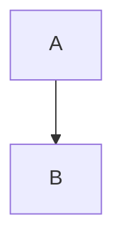

# Fmt this Shit - AI/Markdown 转 Word 转换工具

一键将 Markdown/AI 输出转换为格式完美的 Word 文档

[](https://opensource.org/licenses/MIT)

## 功能特性

- 📝 **实时预览** - 输入时自动转换并预览
- 🧮 **数学公式** - 完美支持 LaTeX 数学公式
- 📊 **Mermaid 图表** - 流程图自动渲染为图片
- 📋 **表格转换** - Markdown 表格转 Word 表格
- 💻 **代码块** - 保留代码格式和语法高亮
- 📄 **批量导出** - 一键导出 Word 文档
- 🚀 **一键启动** - 开箱即用的便携包版本

---

## 获取方式

### 📦 便携包版（推荐）

不想配置环境？直接下载便携包，双击 `start.bat` 即可运行。

➡️ [前往 Releases 下载最新便携包](https://github.com/darknessbright/fmt-this-shit/releases)

### 💻 源码版

开发者或需要自定义配置的用户，可以从源码运行：

```bash
git clone https://github.com/darknessbright/fmt-this-shit.git
cd fmt-this-shit
# 参考下方安装说明
```

---

## 系统要求

### 便携包版
- Windows 10 或更高版本
- 无需安装 Python/Node.js

### 源码版
- Python 3.8 或更高版本
- Node.js 16+ 和 npm
- Windows 10+ / macOS / Linux

---

## 快速开始

### 方式一：便携包版（推荐）

1. 从 [Releases](https://github.com/darknessbright/fmt-this-shit/releases) 下载便携包
2. 解压缩到任意目录
3. 双击 `start.bat`
4. 浏览器自动打开 http://localhost:5678

### 方式二：源码版

#### Windows 用户

```bash
# 1. 克隆仓库
git clone https://github.com/darknessbright/fmt-this-shit.git
cd fmt-this-shit

# 2. 一键启动（自动配置环境）
start.bat
```

#### macOS/Linux 用户

```bash
# 1. 克隆仓库
git clone https://github.com/darknessbright/fmt-this-shit.git
cd fmt-this-shit

# 2. 创建虚拟环境
python3 -m venv .venv
source .venv/bin/activate

# 3. 安装依赖
pip install -r requirements.txt
npm install @mermaid-js/mermaid-cli

# 4. 下载 Pandoc
# 访问 https://pandoc.org/installing.html
# 解压到项目根目录的 pandoc/ 文件夹

# 5. 启动服务
python backend/app.py
```

启动成功后，访问 http://localhost:5678

---

## 使用说明

### Markdown 语法支持

#### 标题
```markdown
# 一级标题
## 二级标题
### 三级标题
```

#### 数学公式
- 行内公式: `$E=mc^2$`
- 块级公式: `$$\int_0^1 x dx$$`

#### Mermaid 图表
````markdown

````

#### 表格
```markdown
| 列1 | 列2 |
|-----|-----|
| 内容1 | 内容2 |
```

#### 代码块
````markdown
```python
def hello():
    print("Hello, World!")
```
````

### 基本操作

1. **输入内容** - 在左侧编辑器输入 Markdown 或 AI 生成的文本
2. **实时预览** - 右侧自动显示转换效果
3. **导出 Word** - 点击"导出 Word"按钮下载文档

---

## 技术栈

- **后端**: Flask 3.0, Pandoc, python-docx
- **前端**: HTML5, CSS3, JavaScript (ES6+)
- **编辑器**: CodeMirror 5.x
- **图表渲染**: mermaid-cli
- **数学公式**: MathJax 3.x (浏览器端渲染)

---

## 项目结构

```
fmt-this-shit/
├── backend/           # Flask 后端
│   ├── app.py        # 应用入口
│   ├── convert.py    # 转换逻辑
│   └── temp/         # 临时文件（自动清理）
├── frontend/          # 前端文件
│   ├── index.html    # 主页面
│   ├── css/          # 样式文件
│   ├── js/           # JavaScript
│   └── libs/         # 第三方库
│       └── codemirror/  # CodeMirror（需单独下载）
├── docs/             # 文档
├── start.bat         # Windows 一键启动脚本
├── requirements.txt  # Python 依赖
└── package.json      # npm 依赖配置
```

---

## 常见问题

### Q: 便携包版和源码版有什么区别？
**A:** 便携包版内置了 Python 虚拟环境和 npm 依赖，下载后双击 `start.bat` 即可运行，适合不想配置环境的用户。源码版需要自己安装 Python 和 Node.js，但可以自定义配置。

### Q: Mermaid 图表不显示？
**A:**
- **便携包版**: 已内置 mermaid-cli，直接可用
- **源码版**: 运行 `npm install @mermaid-js/mermaid-cli` 安装

### Q: 数学公式显示异常？
**A:** 确认 Pandoc 版本正确（2.19+）。便携包版已内置正确版本。

### Q: 导出的 Word 打不开？
**A:** 检查 `backend/temp/` 目录是否有写入权限。

### Q: CodeMirror 编辑器无法加载？
**A:** 需要单独下载 CodeMirror 5.x：
1. 访问 https://codemirror.net/
2. 下载并解压到 `frontend/libs/codemirror/`

---

## 许可证

本项目采用 [MIT License](LICENSE) 开源协议。

---

## 贡献

欢迎提交 Issue 和 Pull Request！

- 🐛 [报告 Bug](https://github.com/darknessbright/fmt-this-shit/issues/new?template=bug_report.md)
- 💡 [功能建议](https://github.com/darknessbright/fmt-this-shit/issues/new?template=feature_request.md)
- 🔧 [提交代码](https://github.com/darknessbright/fmt-this-shit/pulls)

---

## Star History

如果这个项目对你有帮助，请给一个 ⭐️ Star！
