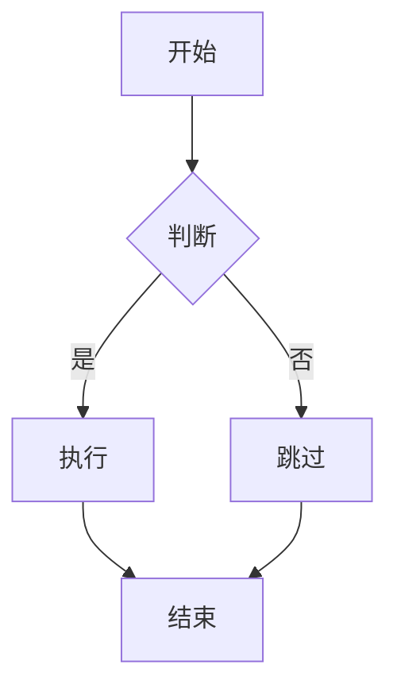

# AI2Word 测试计划

## 测试环境

- Python 3.8+
- Flask 3.0.0
- Pandoc (便携版)
- mermaid-cli
- CodeMirror 5.x

## 测试用例

### 1. 基础功能测试

#### 1.1 启动测试
- [ ] 运行 `start.bat` 能正常启动应用
- [ ] 浏览器自动打开 http://localhost:5678
- [ ] 控制台显示启动信息

#### 1.2 页面加载测试
- [ ] 首页加载正常，显示 AI2Word 标题
- [ ] 左侧编辑器显示示例内容
- [ ] 右侧预览区显示渲染后的内容
- [ ] 导出按钮显示正常

### 2. Markdown 转换测试

#### 2.1 基础语法
- [ ] 标题转换正确（#, ##, ###）
- [ ] 列表转换正确（有序、无序）
- [ ] 粗体/斜体转换正确
- [ ] 代码块转换正确

#### 2.2 数学公式
输入: `$x = \frac{-b \pm \sqrt{b^2-4ac}}{2a}$`
- [ ] 预览显示公式
- [ ] Word 导出公式正确

#### 2.3 表格转换
输入 Markdown 表格:
| 列1 | 列2 |
|-----|-----|
| A | B |
- [ ] 预览显示表格
- [ ] Word 导出表格正确

### 3. Mermaid 图表测试

#### 3.1 流程图
输入:

- [ ] 预览显示图片
- [ ] Word 导出图片正确

### 4. 实时预览测试
- [ ] 输入内容后 500ms 内自动更新预览
- [ ] 显示"转换中..."加载状态
- [ ] 转换错误时显示错误信息

### 5. 导出功能测试
- [ ] 点击"导出 Word"下载 .docx 文件
- [ ] 下载的文件能用 Word 打开
- [ ] 文件内容格式正确
- [ ] 点击"导出 PDF"显示开发中提示

### 6. 边界情况测试

#### 6.1 空内容
- [ ] 清空编辑器后预览显示提示信息
- [ ] 点击导出时提示"请先输入内容"

#### 6.2 大文件
- [ ] 输入长文档（>1000 行）不卡顿
- [ ] 转换完成无错误

#### 6.3 特殊字符
- [ ] 包含 emoji 的内容正常显示
- [ ] 包含特殊符号（<, >, &, ）正常转换

## 已知问题

### 记录的问题和改进建议

1. **前端 XSS 防护** (已记录)
   - 当前: 直接设置 innerHTML
   - 建议: 添加 DOMPurify 进行输入净化

2. **错误处理增强** (已记录)
   - 当前: 通用错误消息
   - 建议: 添加详细错误分类和提示

3. **临时文件清理** (已记录)
   - 当前: Mermaid 生成的临时文件不清理
   - 建议: 添加定期清理机制

## 测试结果

### 测试日期: [待填写]
### 测试人员: [待填写]
### 结果: [待填写]

- 通过: ___ 个
- 失败: ___ 个
- 阻塞: ___ 个

### 备注
[记录测试过程中的发现和问题]
