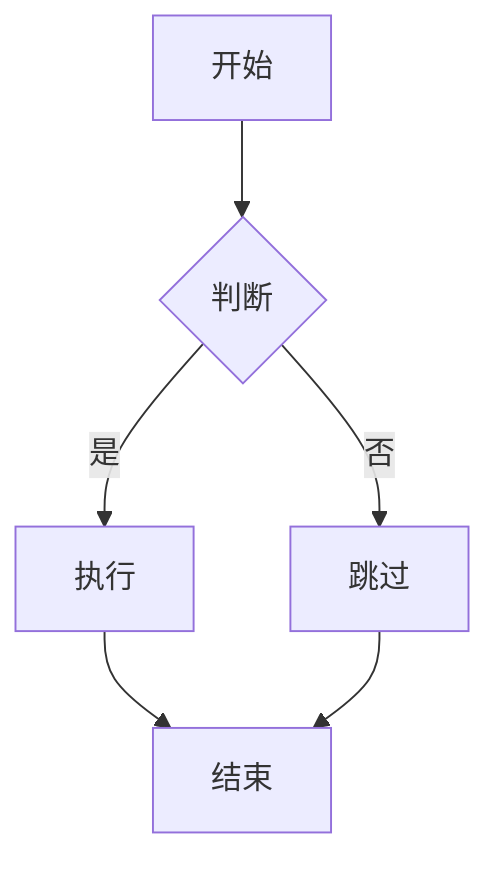

# AI2Word 使用说明

## 快速开始

双击 `start.bat` 即可启动应用。浏览器将自动打开 http://localhost:5678

## 界面说明

### 布局
- **顶部栏**: 应用标题和导出按钮
- **左侧面板**: Markdown 输入编辑器
- **右侧面板**: 实时预览区域
- **底部栏**: 功能提示

### 按钮说明
- **导出 Word**: 将当前内容下载为 .docx 文件
- **导出 PDF**: 暂未实现，显示提示信息

## Markdown 语法

### 标题

```markdown
# 一级标题
## 二级标题
### 三级标题
#### 四级标题
```

### 文本格式

```markdown
**粗体文本**
*斜体文本*
***粗斜体文本***
~~删除线~~
```

### 列表

```markdown
- 无序列表项 1
- 无序列表项 2
  - 子项

1. 有序列表项 1
2. 有序列表项 2
```

### 数学公式

#### 行内公式
```markdown
爱因斯坦质能方程: $E=mc^2$
```

#### 块级公式
```markdown
$$
x = \frac{-b \pm \sqrt{b^2-4ac}}{2a}
$$
```

### 代码块

````markdown
```python
def hello():
    print("Hello, World!")
```
````

### 表格

```markdown
| 列1 | 列2 | 列3 |
|-----|-----|-----|
| A   | B   | C   |
| D   | E   | F   |
```

### Mermaid 图表

````markdown

````

### 引用

```markdown
> 这是一段引用文本
>> 嵌套引用
```

### 分隔线

```markdown
---
```

## 使用技巧

### 1. 实时预览
- 输入内容后自动在 500ms 后更新预览
- 转换过程中显示"转换中..."提示

### 2. 导出文档
- 点击"导出 Word"按钮下载 .docx 文件
- 文件名包含时间戳，避免覆盖

### 3. 错误处理
- 如果转换失败，预览区会显示错误信息
- 检查输入格式是否正确

## 常见问题

### Q: 为什么我的 Mermaid 图表不显示？
**A**: 可能的原因：
1. mermaid-cli 未正确安装
2. Mermaid 语法错误
3. 图表过于复杂导致渲染超时

解决方法：
```bash
# 检查 mermaid-cli 是否安装
npm list @mermaid-js/mermaid-cli

# 重新安装
npm install @mermaid-js/mermaid-cli
```

### Q: 数学公式显示为乱码？
**A**:
1. 确认 Pandoc 版本 >= 2.19
2. 检查公式语法是否正确
3. 某些复杂公式可能需要特殊处理

### Q: 表格显示不正确？
**A**: 确保：
1. 表格每行对齐
2. 使用 `|` 分隔列
3. 表格前后有空行

### Q: 代码块没有高亮？
**A**: 当前版本仅支持基础代码块，语法高亮功能计划在后续版本添加。

### Q: 导出的 Word 文档格式不对？
**A**:
1. 确认使用的是 Microsoft Word 2007 或更高版本
2. 检查 Pandoc 是否正确安装
3. 尝试简单的 Markdown 内容测试

## 键盘快捷键

暂不支持，计划在后续版本添加。

## 示例

### 完整示例

````markdown
# 数学笔记

## 微积分基本定理

$$
\int_a^b f(x)dx = F(b) - F(a)
$$

其中 $F'(x) = f(x)$。

## 算法流程


## 数据表格

| x | f(x) |
|---|------|
| 0 | 0    |
| 1 | 1    |
| 2 | 4    |
````

## 进阶使用

### 自定义样式
当前版本使用统一的默认样式。自定义样式功能计划在后续版本添加。

### 批量转换
需要批量转换多个文件？可以考虑以下方法：
1. 编写脚本调用后端 API
2. 使用 Pandoc 命令行直接处理

## 获取帮助

- 查看 [README.md](../README.md) 了解项目概况
- 提交 Issue 反馈问题
- 查看 [测试计划](TEST_PLAN.md) 了解功能验证
