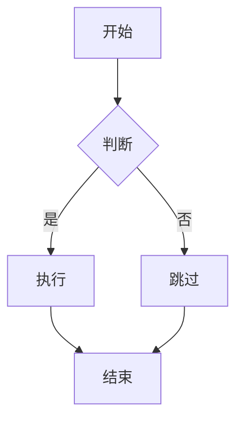
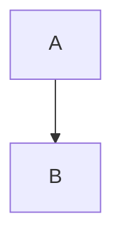

# AI2Word 实施计划

> **For Claude:** REQUIRED SUB-SKILL: Use superpowers:executing-plans to implement this plan task-by-task.

**目标：** 构建一个便携式的 AI/Markdown 转 Word 转换工具，支持 LaTeX 公式、Mermaid 图表、表格等转换，提供实时预览和导出功能。

**架构：** Flask 后端提供 RESTful API，Pandoc 处理核心转换，python-docx 调整样式，mermaid-cli 渲染图表；前端使用 CodeMirror 编辑器实现实时预览。

**技术栈：** Flask, Pandoc, python-docx, mermaid-cli, CodeMirror, HTML/CSS/JS

---

## Task 1: 项目结构搭建

**文件：**
- 创建: `backend/`, `frontend/`, `backend/temp/`, `frontend/libs/`, `pandoc/`
- 创建: `requirements.txt`
- 创建: `package.json`
- 创建: `README.md`

### Step 1: 创建项目目录结构

```bash
mkdir -p backend/temp frontend/libs/css frontend/libs/js pandoc
```

### Step 2: 创建 requirements.txt

```bash
cat > requirements.txt << 'EOF'
Flask==3.0.0
python-docx==1.1.0
markdown==3.5.1
EOF
```

### Step 3: 创建 package.json

```bash
cat > package.json << 'EOF'
{
  "name": "ai2word",
  "version": "1.0.0",
  "description": "AI/Markdown to Word converter",
  "dependencies": {
    "@mermaid-js/mermaid-cli": "^10.6.1"
  }
}
EOF
```

### Step 4: 创建 README.md

```bash
cat > README.md << 'EOF'
# AI2Word

AI/Markdown 转 Word 转换工具

## 快速开始

双击 `start.bat` 启动应用

## 手动安装

1. 创建虚拟环境: `python -m venv .venv`
2. 安装 Python 依赖: `.venv\Scripts\pip install -r requirements.txt`
3. 下载 Pandoc: 从 https://pandoc.org/installing.html 下载便携版，解压到 `pandoc/` 目录
4. 安装 mermaid-cli: `npm install`
5. 启动服务: `.venv\Scripts\python backend/app.py`
6. 访问: http://localhost:5678

## 功能

- Markdown 转 Word/PDF
- LaTeX 数学公式支持
- Mermaid 流程图支持
- 实时预览
EOF
```

### Step 5: 提交

```bash
git add requirements.txt package.json README.md backend/ frontend/ pandoc/
git commit -m "feat: 搭建项目目录结构"
```

---

## Task 2: 后端 - Flask 基础框架

**文件：**
- 创建: `backend/app.py`

### Step 1: 创建 Flask 应用主文件

```python
# backend/app.py
from flask import Flask, send_file, request, jsonify, render_template_string
import os

app = Flask(__name__, static_folder='../frontend', static_url_path='')

@app.route('/')
def index():
    """返回主页面"""
    return send_file('../frontend/index.html')

@app.route('/api/health')
def health():
    """健康检查"""
    return jsonify({
        'status': 'ok',
        'pandoc_available': os.path.exists('../pandoc/pandoc.exe'),
        'mermaid_available': os.path.exists('../node_modules/.bin/mmdc.cmd')
    })

@app.route('/api/convert', methods=['POST'])
def convert():
    """转换接口 - 占位符"""
    data = request.json
    markdown = data.get('markdown', '')
    # TODO: 实现转换逻辑
    return jsonify({
        'html': '<p>预览功能开发中</p>',
        'docx_url': None,
        'pdf_url': None
    })

if __name__ == '__main__':
    print("=" * 40)
    print("  AI2Word 服务启动")
    print("  访问地址: http://localhost:5678")
    print("  按 Ctrl+C 停止服务")
    print("=" * 40)
    app.run(host='127.0.0.1', port=5678, debug=True)
```

### Step 2: 提交

```bash
git add backend/app.py
git commit -m "feat: 添加 Flask 基础框架"
```

---

## Task 3: 后端 - 转换核心逻辑

**文件：**
- 创建: `backend/convert.py`
- 修改: `backend/app.py`

### Step 1: 创建转换模块

```python
# backend/convert.py
import os
import subprocess
import tempfile
import shutil
import re
import uuid
from docx import Document
from docx.shared import Pt, Inches
from docx.enum.text import WD_PARAGRAPH_ALIGNMENT

PANDOC_PATH = '../pandoc/pandoc.exe'
MMDC_PATH = '../node_modules/.bin/mmdc.cmd'
TEMP_DIR = 'backend/temp'

def ensure_temp_dir():
    """确保临时目录存在"""
    os.makedirs(TEMP_DIR, exist_ok=True)

def render_mermaid_diagrams(markdown):
    """渲染 Mermaid 图表为图片

    Args:
        markdown: Markdown 内容

    Returns:
        dict: {mermaid_code: image_path} 字典
    """
    ensure_temp_dir()

    # 匹配 ```mermaid 代码块
    pattern = r'```mermaid\n(.*?)\n```'
    matches = re.findall(pattern, markdown, re.DOTALL)

    if not matches:
        return {}

    images = {}
    for i, mermaid_code in enumerate(matches):
        # 生成唯一文件名
        file_id = str(uuid.uuid4())[:8]
        temp_mmd = os.path.join(TEMP_DIR, f'diagram_{file_id}.mmd')
        output_png = os.path.join(TEMP_DIR, f'diagram_{file_id}.png')

        try:
            # 写入 mermaid 代码
            with open(temp_mmd, 'w', encoding='utf-8') as f:
                f.write(mermaid_code)

            # 调用 mermaid-cli 渲染
            result = subprocess.run(
                [MMDC_PATH, '-i', temp_mmd, '-o', output_png, '-b', 'transparent'],
                capture_output=True,
                timeout=30,
                shell=True
            )

            if result.returncode == 0 and os.path.exists(output_png):
                images[mermaid_code] = f'/api/download/{os.path.basename(output_png)}'
        except Exception as e:
            print(f"Mermaid 渲染失败: {e}")

    return images

def replace_mermaid_with_images(markdown, images):
    """将 mermaid 代码块替换为图片引用

    Args:
        markdown: Markdown 内容
        images: {mermaid_code: image_path} 字典

    Returns:
        str: 替换后的 Markdown
    """
    for code, img_path in images.items():
        markdown = markdown.replace(
            f'```mermaid\n{code}\n```',
            f''
        )
    return markdown

def convert_with_pandoc(markdown, output_path):
    """使用 Pandoc 转换 Markdown 到 Word

    Args:
        markdown: Markdown 内容
        output_path: 输出 .docx 文件路径

    Returns:
        bool: 转换是否成功
    """
    ensure_temp_dir()

    # 创建临时 markdown 文件
    temp_md = os.path.join(TEMP_DIR, f'temp_{uuid.uuid4().hex[:8]}.md')
    with open(temp_md, 'w', encoding='utf-8') as f:
        f.write(markdown)

    try:
        # 调用 pandoc
        result = subprocess.run(
            [
                PANDOC_PATH,
                temp_md,
                '-f', 'markdown',
                '-t', 'docx',
                '--mathml',  # 数学公式转换为 MathML
                '--extract-media=temp',  # 提取媒体文件
                '-o', output_path
            ],
            capture_output=True,
            timeout=60,
            shell=True
        )
        return result.returncode == 0
    except Exception as e:
        print(f"Pandoc 转换失败: {e}")
        return False
    finally:
        # 清理临时文件
        if os.path.exists(temp_md):
            os.remove(temp_md)

def adjust_docx_styles(docx_path):
    """调整 Word 文档样式

    Args:
        docx_path: .docx 文件路径
    """
    try:
        doc = Document(docx_path)

        # 设置默认字体
        style = doc.styles['Normal']
        font = style.font
        font.name = 'Microsoft YaHei'
        font.size = Pt(11)

        # 设置行间距
        paragraph_format = style.paragraph_format
        paragraph_format.line_spacing = 1.5

        # 设置页边距
        for section in doc.sections:
            section.top_margin = Inches(1)
            section.bottom_margin = Inches(1)
            section.left_margin = Inches(1.25)
            section.right_margin = Inches(1.25)

        doc.save(docx_path)
    except Exception as e:
        print(f"样式调整失败: {e}")

def convert_markdown(markdown):
    """完整的 Markdown 转 Word 流程

    Args:
        markdown: 用户输入的 Markdown 内容

    Returns:
        dict: {html, docx_url, pdf_url}
    """
    ensure_temp_dir()

    # 1. 渲染 Mermaid 图表
    mermaid_images = render_mermaid_diagrams(markdown)

    # 2. 替换 mermaid 代码块为图片
    markdown_with_images = replace_mermaid_with_images(markdown, mermaid_images)

    # 3. 生成唯一文件名
    file_id = uuid.uuid4().hex[:12]
    docx_filename = f'{file_id}.docx'
    docx_path = os.path.join(TEMP_DIR, docx_filename)

    # 4. Pandoc 转换
    success = convert_with_pandoc(markdown_with_images, docx_path)

    if not success:
        return {
            'html': '<p style="color: red;">转换失败，请检查输入格式</p>',
            'docx_url': None,
            'pdf_url': None
        }

    # 5. 调整样式
    adjust_docx_styles(docx_path)

    # 6. 生成预览 HTML（简化版）
    html = generate_preview_html(markdown_with_images)

    return {
        'html': html,
        'docx_url': f'/api/download/{docx_filename}',
        'pdf_url': None  # PDF 功能后续添加
    }

def generate_preview_html(markdown):
    """生成预览 HTML（简化实现）

    Args:
        markdown: Markdown 内容

    Returns:
        str: HTML 预览
    """
    # 简单处理：将 Markdown 转换为基本 HTML
    html = markdown

    # 标题
    html = re.sub(r'^# (.+)$', r'<h1>\1</h1>', html, flags=re.MULTILINE)
    html = re.sub(r'^## (.+)$', r'<h2>\1</h2>', html, flags=re.MULTILINE)
    html = re.sub(r'^### (.+)$', r'<h3>\1</h3>', html, flags=re.MULTILINE)

    # 粗体/斜体
    html = re.sub(r'\*\*(.+?)\*\*', r'<strong>\1</strong>', html)
    html = re.sub(r'\*(.+?)\*', r'<em>\1</em>', html)

    # 代码块
    html = re.sub(r'```(\w+)?\n(.+?)```', r'<pre><code>\2</code></pre>', html, flags=re.DOTALL)

    # 图片
    html = re.sub(r'!\[(.+?)\]\((.+?)\)', r'', html)

    # 段落
    lines = html.split('\n')
    html_lines = []
    for line in lines:
        line = line.strip()
        if line and not line.startswith('<'):
            line = f'<p>{line}</p>'
        html_lines.append(line)
    html = '\n'.join(html_lines)

    return f'''
    <div style="font-family: 'Microsoft YaHei', Arial; padding: 20px; line-height: 1.6;">
        {html}
    </div>
    '''
```

### Step 2: 更新 app.py 集成转换模块

```python
# backend/app.py 顶部添加导入
from convert import convert_markdown

# 修改 /api/convert 路由
@app.route('/api/convert', methods=['POST'])
def convert():
    """转换接口"""
    data = request.json
    markdown = data.get('markdown', '')

    if not markdown.strip():
        return jsonify({'error': '内容不能为空'}), 400

    try:
        result = convert_markdown(markdown)
        return jsonify(result)
    except Exception as e:
        return jsonify({'error': str(e)}), 500

# 添加下载路由
@app.route('/api/download/<filename>')
def download(filename):
    """文件下载"""
    file_path = os.path.join('temp', filename)

    if not os.path.exists(file_path):
        return jsonify({'error': '文件不存在'}), 404

    return send_file(
        file_path,
        as_attachment=True,
        download_name=filename
    )
```

### Step 3: 提交

```bash
git add backend/convert.py backend/app.py
git commit -m "feat: 实现核心转换逻辑"
```

---

## Task 4: 前端 - 主页面结构

**文件：**
- 创建: `frontend/index.html`
- 创建: `frontend/css/style.css`

### Step 1: 创建 HTML 主页面

```html
<!DOCTYPE html>
<html lang="zh-CN">
<head>
    <meta charset="UTF-8">
    <meta name="viewport" content="width=device-width, initial-scale=1.0">
    <title>AI2Word - Markdown 转 Word</title>
    <link rel="stylesheet" href="/libs/codemirror/lib/codemirror.css">
    <link rel="stylesheet" href="/libs/codemirror/theme/default.css">
    <link rel="stylesheet" href="/css/style.css">
</head>
<body>
    <div class="header">
        <h1>AI2Word</h1>
        <div class="actions">
            <button id="exportWord" class="btn btn-primary">导出 Word</button>
            <button id="exportPdf" class="btn btn-secondary">导出 PDF</button>
        </div>
    </div>

    <div class="main">
        <div class="editor-panel">
            <div class="panel-header">Markdown 输入</div>
            <textarea id="editor"></textarea>
        </div>

        <div class="preview-panel">
            <div class="panel-header">实时预览</div>
            <div id="preview" class="preview-content">
                <p class="placeholder">在左侧输入 Markdown 内容，这里将显示预览...</p>
            </div>
        </div>
    </div>

    <div class="footer">
        <p>支持 Markdown、LaTeX 公式 ($E=mc^2$)、Mermaid 图表、代码块、表格转换</p>
    </div>

    <script src="/libs/codemirror/lib/codemirror.js"></script>
    <script src="/libs/codemirror/mode/markdown/markdown.js"></script>
    <script src="/js/app.js"></script>
</body>
</html>
```

### Step 2: 创建 CSS 样式

```css
/* frontend/css/style.css */
* {
    margin: 0;
    padding: 0;
    box-sizing: border-box;
}

body {
    font-family: 'Microsoft YaHei', Arial, sans-serif;
    height: 100vh;
    display: flex;
    flex-direction: column;
    background-color: #f5f5f5;
}

.header {
    background-color: #2c3e50;
    color: white;
    padding: 15px 30px;
    display: flex;
    justify-content: space-between;
    align-items: center;
    box-shadow: 0 2px 4px rgba(0,0,0,0.1);
}

.header h1 {
    font-size: 24px;
    font-weight: 500;
}

.actions {
    display: flex;
    gap: 10px;
}

.btn {
    padding: 10px 20px;
    border: none;
    border-radius: 4px;
    cursor: pointer;
    font-size: 14px;
    transition: opacity 0.2s;
}

.btn:hover {
    opacity: 0.9;
}

.btn-primary {
    background-color: #3498db;
    color: white;
}

.btn-secondary {
    background-color: #95a5a6;
    color: white;
}

.main {
    flex: 1;
    display: flex;
    overflow: hidden;
}

.editor-panel, .preview-panel {
    flex: 1;
    display: flex;
    flex-direction: column;
    border-right: 1px solid #ddd;
}

.preview-panel {
    border-right: none;
}

.panel-header {
    background-color: #ecf0f1;
    padding: 10px 20px;
    font-weight: 500;
    color: #2c3e50;
    border-bottom: 1px solid #ddd;
}

#editor {
    flex: 1;
    border: none;
    resize: none;
    font-family: 'Consolas', 'Monaco', monospace;
    font-size: 14px;
    line-height: 1.6;
    padding: 20px;
}

.CodeMirror {
    height: 100%;
    font-family: 'Consolas', 'Monaco', monospace;
    font-size: 14px;
}

.preview-content {
    flex: 1;
    padding: 20px;
    overflow-y: auto;
    background-color: white;
}

.placeholder {
    color: #95a5a6;
    text-align: center;
    margin-top: 50px;
}

.footer {
    background-color: #ecf0f1;
    padding: 10px 30px;
    text-align: center;
    font-size: 12px;
    color: #7f8c8d;
}

.loading {
    display: inline-block;
    color: #3498db;
}

.loading::after {
    content: '...';
    animation: dots 1.5s steps(4, end) infinite;
}

@keyframes dots {
    0%, 20% { content: '.'; }
    40% { content: '..'; }
    60%, 100% { content: '...'; }
}
```

### Step 3: 提交

```bash
git add frontend/index.html frontend/css/style.css
git commit -m "feat: 创建前端页面结构"
```

---

## Task 5: 前端 - JavaScript 交互逻辑

**文件：**
- 创建: `frontend/js/app.js`

### Step 1: 创建应用主逻辑

```javascript
// frontend/js/app.js

// 初始化 CodeMirror 编辑器
const editor = CodeMirror.fromTextArea(document.getElementById('editor'), {
    mode: 'markdown',
    lineNumbers: true,
    lineWrapping: true,
    theme: 'default'
});

// 防抖函数
function debounce(func, wait) {
    let timeout;
    return function(...args) {
        clearTimeout(timeout);
        timeout = setTimeout(() => func.apply(this, args), wait);
    };
}

// 当前转换状态
let currentDocxUrl = null;
let currentPdfUrl = null;
let isConverting = false;

// 转换 Markdown
async function convertMarkdown() {
    const markdown = editor.getValue();

    if (!markdown.trim()) {
        document.getElementById('preview').innerHTML =
            '<p class="placeholder">在左侧输入 Markdown 内容，这里将显示预览...</p>';
        currentDocxUrl = null;
        currentPdfUrl = null;
        return;
    }

    if (isConverting) return;

    isConverting = true;
    const preview = document.getElementById('preview');
    preview.innerHTML = '<p class="loading">转换中</p>';

    try {
        const response = await fetch('/api/convert', {
            method: 'POST',
            headers: {
                'Content-Type': 'application/json'
            },
            body: JSON.stringify({ markdown })
        });

        if (!response.ok) {
            throw new Error('转换失败');
        }

        const data = await response.json();

        // 更新预览
        preview.innerHTML = data.html;

        // 保存下载链接
        currentDocxUrl = data.docx_url;
        currentPdfUrl = data.pdf_url;

    } catch (error) {
        preview.innerHTML = `<p style="color: red;">转换失败: ${error.message}</p>`;
    } finally {
        isConverting = false;
    }
}

// 防抖的转换函数
const debouncedConvert = debounce(convertMarkdown, 500);

// 监听编辑器变化
editor.on('change', debouncedConvert);

// 导出 Word
document.getElementById('exportWord').addEventListener('click', async () => {
    if (!currentDocxUrl) {
        alert('请先输入内容并等待转换完成');
        return;
    }

    // 触发下载
    const link = document.createElement('a');
    link.href = currentDocxUrl;
    link.download = `document_${Date.now()}.docx`;
    link.click();
});

// 导出 PDF
document.getElementById('exportPdf').addEventListener('click', () => {
    alert('PDF 导出功能开发中，请使用 Word 导出后手动转换');
});

// 初始化示例内容
const exampleMarkdown = `# 欢迎使用 AI2Word

这是一个 Markdown 转 Word 的工具。

## 支持的功能

- **粗体** 和 *斜体*
- 数学公式: $E=mc^2$
- 代码块
- 表格

## 示例代码

\`\`\`python
def hello():
    print("Hello, World!")
\`\`\`

开始输入你的内容吧！
`;

editor.setValue(exampleMarkdown);
```

### Step 2: 提交

```bash
git add frontend/js/app.js
git commit -m "feat: 实现前端交互逻辑"
```

---

## Task 6: 启动脚本

**文件：**
- 创建: `start.bat`

### Step 1: 创建启动脚本

```batch
@echo off
chcp 65001 >nul
echo ===================================
echo   AI2Word 启动中...
echo ===================================
echo.

REM 1. 检查 Python 虚拟环境
if not exist .venv (
    echo [1/5] 创建 Python 虚拟环境...
    python -m venv .venv
) else (
    echo [1/5] Python 虚拟环境已存在
)

REM 2. 激活虚拟环境并安装依赖
echo [2/5] 检查 Python 依赖...
.venv\Scripts\python -m pip install --upgrade pip
.venv\Scripts\pip install -r requirements.txt

REM 3. 检查 Pandoc
if not exist pandoc\pandoc.exe (
    echo [3/5] 警告: 未找到 pandoc.exe
    echo       请从 https://pandoc.org/installing.html 下载 Windows 便携版
    echo       解压到项目的 pandoc/ 目录
    echo.
    pause
    exit
) else (
    echo [3/5] Pandoc 已就绪
)

REM 4. 检查 mermaid-cli
if not exist node_modules\.bin\mmdc.cmd (
    echo [4/5] 安装 mermaid-cli...
    call npm install @mermaid-js/mermaid-cli
) else (
    echo [4/5] mermaid-cli 已就绪
)

REM 5. 启动 Flask 服务
echo [5/5] 启动 Flask 服务...
echo.
echo ===================================
echo   服务地址: http://localhost:5678
echo   按 Ctrl+C 停止服务
echo ===================================
echo.

timeout /t 2 >nul
start http://localhost:5678
.venv\Scripts\python backend/app.py

pause
```

### Step 2: 提交

```bash
git add start.bat
git commit -m "feat: 添加便捷启动脚本"
```

---

## Task 7: 下载前端依赖

**文件：**
- 下载: `frontend/libs/codemirror/`

### Step 1: 下载 CodeMirror

从 https://codemirror.net/ 下载 CodeMirror 5.x 版本，解压到 `frontend/libs/codemirror/` 目录。

确保包含以下文件：
- `lib/codemirror.js`
- `lib/codemirror.css`
- `mode/markdown/markdown.js`
- `theme/default.css`

### Step 2: 创建 .gitkeep 保持目录结构

```bash
touch frontend/libs/codemirror/.gitkeep
```

### Step 3: 更新 .gitignore 忽略 libs 内容

```bash
# 在 .gitignore 添加
frontend/libs/codemirror/*
!frontend/libs/codemirror/.gitkeep
```

### Step 4: 提交

```bash
git add .gitignore frontend/libs/codemirror/.gitkeep
git commit -m "chore: 添加前端依赖目录"
```

---

## Task 8: 测试与验证

### Step 1: 测试基础功能

1. 运行 `start.bat` 启动应用
2. 验证首页加载正常
3. 输入测试内容：
   - 标题、列表、粗体、斜体
   - LaTeX 公式：`$x = \frac{-b \pm \sqrt{b^2-4ac}}{2a}$`
   - 代码块
   - 表格

### Step 2: 测试 Mermaid 图表

输入以下内容测试：

````markdown

````

### Step 3: 测试导出功能

1. 点击"导出 Word"按钮
2. 验证下载的 Word 文档格式正确
3. 检查公式、图表、表格显示正常

### Step 4: 修复发现的问题

记录并修复测试中发现的问题。

### Step 5: 提交

```bash
git add .
git commit -m "fix: 修复测试中发现的问题"
```

---

## Task 9: 文档完善

### Step 1: 更新 README.md

添加更详细的使用说明和故障排除。

### Step 2: 创建使用说明文档

```bash
# 创建 docs/USAGE.md
cat > docs/USAGE.md << 'EOF'
# AI2Word 使用说明

## 快速开始

双击 `start.bat` 即可启动应用。

## Markdown 语法支持

### 标题
```markdown
# 一级标题
## 二级标题
### 三级标题
```

### 数学公式
行内公式: $E=mc^2$
块级公式: $$\int_0^1 x dx$$

### Mermaid 图表
````markdown

````

### 表格
| 列1 | 列2 |
|-----|-----|
| 内容1 | 内容2 |

## 常见问题

### Q: Mermaid 图表不显示？
A: 检查 node_modules 中是否安装了 mermaid-cli

### Q: 公式显示异常？
A: 确认 pandoc/pandoc.exe 存在且版本正确

### Q: 导出的 Word 打不开？
A: 检查 backend/temp/ 目录权限
EOF
```

### Step 3: 提交

```bash
git add README.md docs/USAGE.md
git commit -m "docs: 完善使用文档"
```

---

## 完成清单

完成以上所有任务后，验证：

- [ ] `start.bat` 能正常启动应用
- [ ] 浏览器访问 http://localhost:5678 显示正常
- [ ] 实时预览功能正常
- [ ] Markdown 基础语法转换正确
- [ ] LaTeX 公式转换正确
- [ ] Mermaid 图表渲染正常
- [ ] 表格转换正确
- [ ] 导出 Word 功能正常
- [ ] 所有依赖都本地化，可离线使用
